# HCL Workload Automation Observability for Dynatrace

You can use the HCL Workload Automation (HWA) Observability for Dynatrace to monitor HCL Workload Automation metrics, events, audit and infrastructure logs.

## Content
- [HCL Workload Automation Observability for Dynatrace](#hcl-workload-automation-observability-for-dynatrace)
  - [Content](#content)
  - [Prerequisites](#prerequisites)
  - [Resources Required](#resources-required)
  - [Language support](#language-support)
  - [Solution setup](#solution-setup)
      - [1. Installating and Configuring Dynatrace](#1-installating-and-configuring-dynatrace)
      - [2. Install Dynatrace Operator](#2-install-dynatrace-operator)
      - [3. Verify Dynatrace Operator](#3-verify-dynatrace-operator)
      - [4. Verify Dynatrace Monitoring](#4-verify-dynatrace-monitoring)
  - [Log Processing and Ingestion setup](#log-processing-and-ingestion-setup)
      - [1. Log custom attributes](#1-log-custom-attributes)
      - [2. Log processing](#2-log-processing)
      - [3. Log metrics](#3-log-metrics)
      - [4. Configure more logs](#4-configure-more-logs)
      - [5. Log storage configuration](#5-log-storage-configuration)
  - [WA Monitoring Dashboards and Alerts setup in Dynatrace](#wa-monitoring-dashboards-and-alerts-setup-in-dynatrace)
       - [1. Getting Environment Link](#1-getting-environment-link)
       - [2. Create Access Token](#2-create-access-token)
       - [3. Create Dashboards and Alerts](#3-create-dashboards-and-alerts)
       - [4. Configuring dashboard markdown link](#4-configuring-dashboard-markdown-link)
       - [5. Setup Email Notification for Alerts ( Optional )](#5-setup-email-notification-for-alerts--optional-)
         - [a). Configuring Alert Profile](#a-configuring-alert-profile)
         - [b). Configuring Email Integration](#b-configuring-email-integration)
  - [Metric Processing and Ingestion setup](#metric-processing-and-ingestion-setup)
    - [1. Metric Ingestion](#1-metric-ingestion)
         - [a). Create the Secret](#a-create-the-secret)
    - [2. Ingested metrics in Dynatrace](#2-ingested-metrics-in-dynatrace)
    - [3. Setting Metadata](#3-setting-metadata)
  - [Getting Started with Workload Automation Monitoring](#getting-started-with-workload-automation-monitoring)
  - [FAQs](#faqs)

## Prerequisites
Following prerequisites must be satisfied prior to deploy Dynatrace Solution 
- Kubernetes cluster(OCP V4.7 or above, GKE) with administrative access
- HWA v10 installed on the Kubernetes cluster 
- Tools & Packages 
  - [Helm3](https://helm.sh/docs/intro/install/) 
  - Dynatrace SaaS Version 1.252

Note: To use the HWA Observability Dashboard for Dynatrace, HWA metrics must be available. For information about HWA exposed metrics, see [Exposing metrics to monitor your workload](https://help.hcltechsw.com/workloadautomation/v101/distr/src_ref/awsrgmonprom.html).

 ## Resources Required
 The following resources correspond to the default values required to manage a production environment. These numbers might vary depending on the environment.
 
| Component | Container resource limit | Container memory request |
|--|--|--|
|**hwa-dynatrace-exporter** |CPU: 2, Memory: 4Gi |CPU: 0.5, Memory: 0.5Gi, Storage: n/a  |

## Language support
For dashboards provided within HWA Observability for Dynatrace, the only supported language is English. 

## Solution setup

### 1. Installating and configuring dynatrace
1. From [HCL License Portal](https://id.hcltechsw.com/login/login.htm) download the appropriate HWA Observability installation package:
   HWA Observability for HWA Observability Add-on
2. Installation package for Dynatrace: HWA_OBSERVABILITY_APP_FOR_DYNATRACE_10.1.0.1.tar.gz
3. Follow the below command to untar the gzip file 
  
  ```

	tar -xvzf HWA_OBSERVABILITY_APP_FOR_DYNATRACE_10.1.0.1.tar.gz
  ```

4. Follow the steps mentioned on the ReadMe file to continue solution setup.

#### 2. Install Dynatrace Operator  

To navigate to Kubernetes page, follow these steps and refer to the picture below:

 
1. Within Dynatrace, click on the Deploy Dynatrace menu
2. Select Start Installation button
3. Select Kubernetes or Openshift based on the HWA installed cluster

To get the Dynatrace Operator installation command, refer to the steps and pictures below:

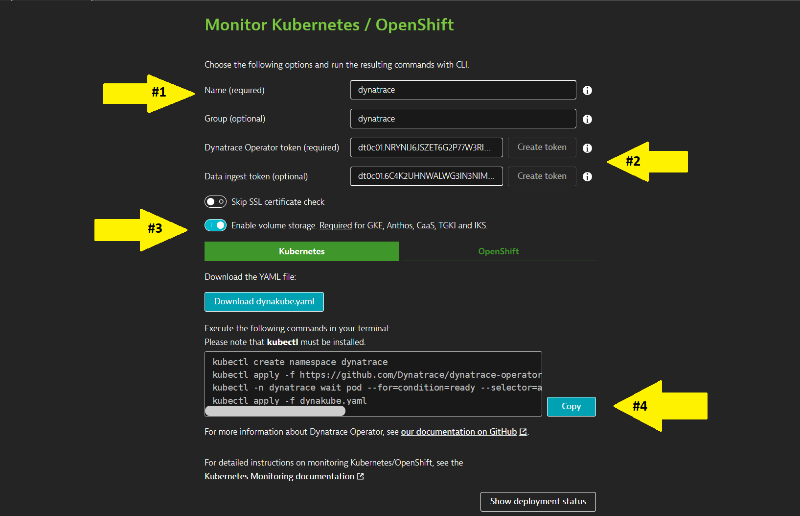
1. On the Kubernetes configuration page, enter dynatrace for the name. This is not the cluster name, it will show up as the Kubernetes page name in Dynatrace
2. Select Create token
3. Select the Enable volume storage Check to be ON
4. Click the Copy button

Paste the command in your environment and run it.

#### 3. Verify Dynatrace Operator  

Once the script is complete, then monitor the installation until all pods are in Running state with all pods as 1/1.
```
kubectl -n dynatrace get pods
```
Rerun the command until the output looks like this:

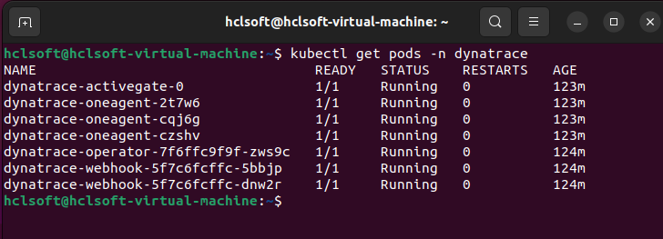

#### 4. Verify Dynatrace Monitoring
1. Go to Infrastructure > Kubernetes
2. Select Dynatrace cluster name
3. Verify all namespaces are present

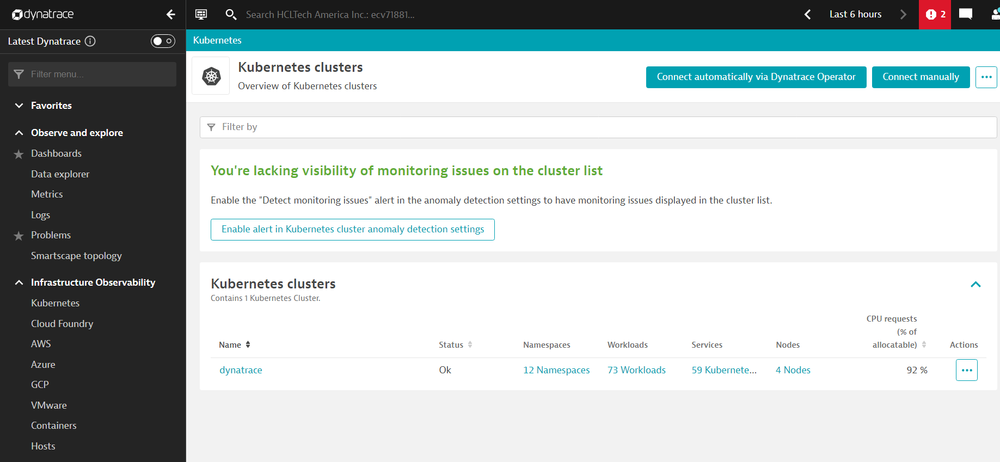

## Log Processing and Ingestion setup
 Dynatrace OneAgent collects all logs container and pods then send it to Dynatrace SaaS. The logs are unstructured so, follow the steps to process the logs.  

 NOTE : This Log Processing and Ingestion setup is developed and tested on  Dynatrace SaaS Version 1.252.

#### 1. Log custom attributes

1. In the Dynatrace menu, go to Settings
2. Select Settings > Log Monitoring > Log custom attributes and then select Add Custom Attribute
3. Add key as Attributes table values
4. Turn on show attribute value in side bar 
5. Select Save Changes  

| Attributes |
| ------ | 
| action.type | 
| audit.type |
| framework.user | 
| object.type |
| username | 
| workstationname |


#### 2. Log processing 

1. In the Dynatrace menu, go to Settings
2. Select Settings > Log Monitoring > Log processing and then select Add Processing Rule
3. Add Processor name as mentioned below
```
WA Log Parsing
```
4. Add Matcher as mentioned below.
```
content="auditType"
```
5. Add Processor definition as mentioned below   
```
PARSE(content, "LD 'auditType' PUNCT? SPACE? STRING:audit.type LD 'objectType' PUNCT? SPACE? STRING:object.type LD 'actionType' PUNCT? SPACE? STRING:action.type LD 'workstationName' PUNCT? SPACE? STRING:workstationname LD 'userName' PUNCT? SPACE? STRING:username LD 'frameworkUser' PUNCT? SPACE? STRING:framework.user")| FIELDS_ADD(action.type:TRIM(action.type))
| FIELDS_ADD(audit.type:TRIM(audit.type))
| FIELDS_ADD(object.type:TRIM(object.type))
| FIELDS_ADD(workstationname:TRIM(workstationname))
| FIELDS_ADD(username:TRIM(username))
```
6. Add log sample as mentioned below   
```
{
  "content":"2022-08-26T07:57:09.416740099Z stdout F {\"timestamp\": \"2022-08-26T07:57:09Z\", \"auditType\": \"PLAN    \", \"objectType\": \"PLJOB   \", \"actionType\": \"ADD     \", \"workstationName\": \"HWA-GKE-SERVER-0\", \"userName\": \"wauser\", \"frameworkUser\": \"\", \"objectName\": \"jb=wks=MASTERAGENTS#fol=/JOBS[null].ELA4\", \"actionDependentContents\": \"\"}"
}
```
7. Select Save Changes  

#### 3. Log metrics 

1. In the Dynatrace menu, go to Settings
2. Select Settings > Log Monitoring > Log metrics and then select Add log metric 
3. Add Key as mentioned below
```
log.wa.content
```
4. Add Query as mentioned below.
```
content="auditType"
```
5. Select Measure as mentioned below
```
Occurrence of logs records
```
6. Add all the Dimension mentioned below

  | Dimension |
  | ------ | 
  | action.type | 
  | audit.type |
  | framework.user | 
  | object.type |
  | username | 
  | workstationname |

7. Select Save Changes  

#### 4. Configure more logs

1. In the Dynatrace menu, go to Kubernetes
2. Select Kubernetes > Dynatrace { your cluster } > wa { your namespace } 
3. Select hwa-gke-waserver {workloads} > hwa-gke-waserver-0 {pods} 
4. Select agent hwa-gke-waserver-* waserver (hwa-gke-waserver-0) { Processes }

 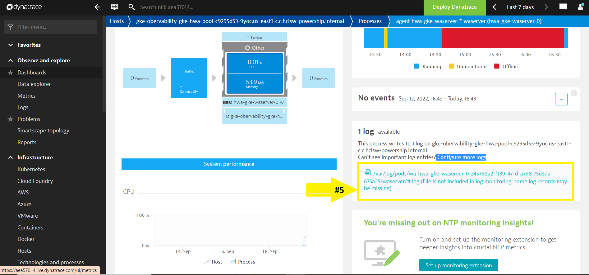

5. Copy your waserver log path. It looks like below.
```
/var/log/pods/wa_hwa-gke-waserver-0_245768a2-f139-471d-a798-75c8da675a35/waserver/#.log
```
6. Select configure more logs and then select Add new log monitoring
7. Replace your waserve log path with waserver-plan-auditing then Save. Follow this same process for waserver-db-auditing ,waserver-bm-events. Examples are given below.
```
/var/log/pods/wa_hwa-gke-waserver-0_245768a2-f139-471d-a798-75c8da675a35/waserver-plan-auditing/#.log
/var/log/pods/wa_hwa-gke-waserver-0_245768a2-f139-471d-a798-75c8da675a35/waserver-db-auditing/#.log
/var/log/pods/wa_hwa-gke-waserver-0_245768a2-f139-471d-a798-75c8da675a35/waserver-bm-events/#.log
```
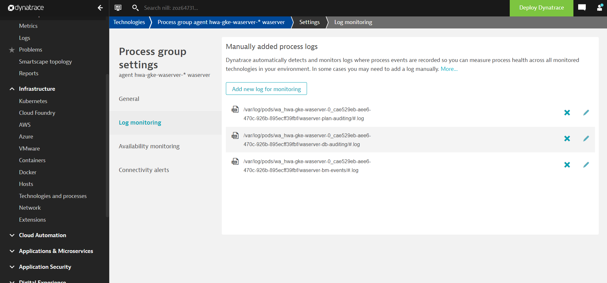

NOTE : Follow the same step for Openshift solution and select the workloads ,pods contains  ***waserver*** name.

#### 5. Log storage configuration 

1. In the Dynatrace menu, go to Settings
2. Select Settings > Log Monitoring > Log storage configuration and then select Add rule
3. Add Rule name as WA Log Storage
4. Select Rule type as Include in storage
5. Select Add Matcher and then select Matcher attribute as Log Source.
6. Add Value as the log path of waserver-plan-auditing, waserver-db-auditing, waserver-bm-events from the previous step and then select Add Matcher. 
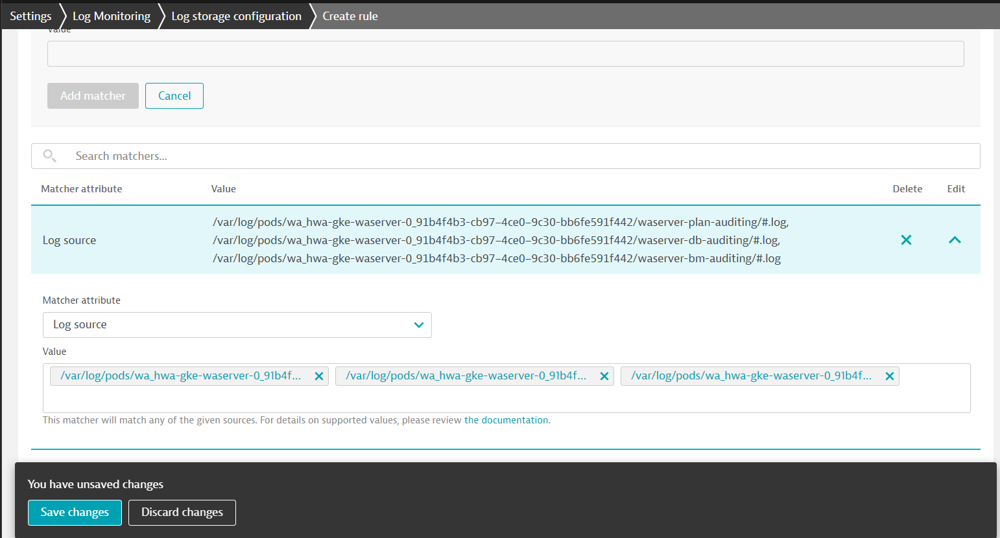
7. Select Save Changes  

 NOTE : if the waserver is deleted and recreated the logs path gets changed. So, follow the step 4 and 5 again once its re-deployed.
 
## WA Monitoring Dashboards and Alerts setup in Dynatrace
   Follow the below steps to upload and configure the WA Monitoring Dashboards and Alerts.
   
NOTE : This Alerts and Email Notification setup is developed and tested on Dynatrace SaaS Version 1.252.

 ##### 1. Getting Environment Link
  1. Select the user icon at the top right corner
  2. Select Account > Account Settings
  3. Go to Consumption by Environment section
  4. Select your Environment and copy the link address of Environment.
  

 ##### 2. Create Access Token
 1. In the Dynatrace menu, go to Access Token and then select Generate new Token
 2. Add your Token name , Expiration date 
 3. Select template as None
 4. Select the scopes mentioned below table.

 | Scope |
| ------ | 
| Write configuration | 
| Ingest metrics |

 5. Select Generate Token and then Copy the Generated Token for further use.


 ##### 3. Create Dashboards and Alerts


1. Run the starter.sh with your ***ENVIRONMENT_LINK***, ***ACCESS_TOKEN*** as parameters. Follow this below command as example.

```
 $ sh ./starter.sh ENVIRONMENT_LINK ACCESS_TOKEN 
```

 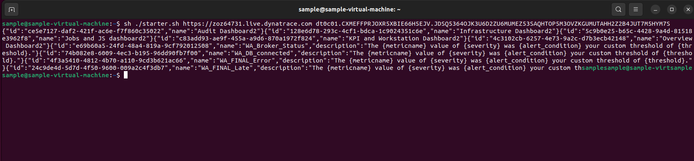
 
 2. Copy the Dashboard ID from terminal for further use

 3. In the Dynatrace menu, go to Dashboards  
  
    - Turn ON show all tenant dasboards option
    - Select Owner as HWA Monitoring
    - Verify all the dashboards are created

 

 4. In the Dynatrace menu, go to Settings
       - Go to Setting > Anomaly detection > Custom events for alerting
       - Verify all the created alerts

 

5.  In the Dynatrace menu, go to Problems and check the raised alerts or select the icon at top right corner

 ##### 4. Configuring dashboard markdown link

 The HWA Observability Dashboard​ provides the link to all dashboards. Once the dashboard is created, new dashboard id is generated for each and every dashboards. So every dashboard id needs to be updated on the HWA Observability Dashboard​ markdown component.

1. Get the copied dashboard id from the Create dashboard step
2. In the Dynatrace menu, go to Dashboards  
3. Select HWA Observability Dashboard​
    - Select Edit option at the top right corner
    - Go to the bottom of the dashboard
    - Select the markdown component as shown in the image and replace your ENVIRONMENT_LINK and id with your respective dashboard id
    - Do this same step for all dashboards. ( Jobs and Job Streams,KPIS and Workstation,Auditing Dashboard,Infrastructure Dashboard ) 

 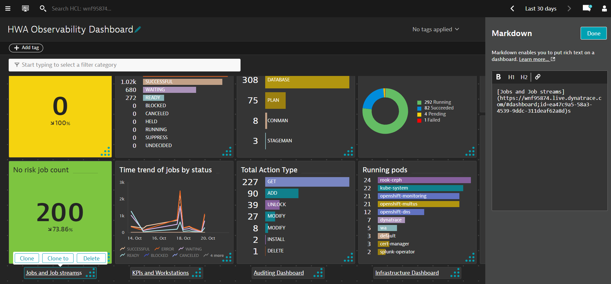

4. Select Done

 ##### 5. Setup Email Notification for Alerts ( Optional )
 

 ###### a). Configuring Alert Profile

 1. In the Dynatrace menu, go to Settings > Alerting > Alerting profiles
 2. Type a name for the new profile in the Create new alerting profile field and select Create
 3. Select Add severity rule then select Problem severity level as **Custom**
 4. Add Problem send delay in minutes as per your requirement. For example, if you add 30, then an email notification will be sent only if the problem remains open for 30 minutes.
 5. Select Save Changes. Keep a note of your Alert Profile Name for future use.   


 


 ###### b). Configuring Email Integration

   Follow this [Email Integration](https://www.dynatrace.com/support/help/setup-and-configuration/integrations/problem-notifications/email-integration) documentation to configure email notification for alerts.

 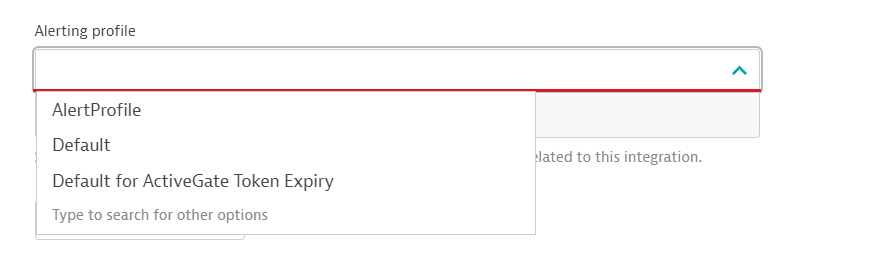

  NOTE : Select the Alerting Profile Name you have configured in the previous step.


## Metric Processing and Ingestion setup

### 1. Metric Ingestion 
We are getting KPI metrics from WA API endpoint using Exporter. Exporter transforms kpi data into dynatrace-supported metric-ingestion format and then, pushes to dynatrace server by making a POST call to Dynatrace **[Metrics v2](https://www.dynatrace.com/support/help/dynatrace-api/environment-api/metric-v2/post-ingest-metrics)**. Metrics are ingested with **[Metric Ingestion Protocol](https://www.dynatrace.com/support/help/extend-dynatrace/extend-metrics/reference/metric-ingestion-protocol)**.

Exporter can be deployed in Kubernetes environment by using the Exporter helm chart. The public Exporter helm chart can be cloned from <REPO> by using the below command:

```
   git clone https://github.com/HCL-TECH-SOFTWARE/HCL-Workload-Automation-Observability-for-Dynatrace.git 
```
  
 After downloading helm charts, set all required environment variables present in the values.yaml file present in CHART-NAME/values.yaml file.

List of environment variables present in values.yaml file are:
| Environment Variables |
| ------ | 
| INVERVAL_OMETRICS| 
| WA_OMETRICS |
| DYNATRACE_SERVER_URL | 
| API_TOKEN |
  
 Note: Refer to above steps to get Dynatrace API token and Server URL.
 
###### a). Create the Secret
If you already have a license then you can proceed to obtain your entitlement key. To learn more about acquiring an HCL Workload Automation license, contact HWAinfo@hcl.com.

Obtain your entitlement key and store it on your cluster by creating a Kubernetes Secret. Using a Kubernetes secret allows you to securely store the key on your cluster and access the registry to download the chart and product images.

Access the entitled registry.
Contact your HCL sales representative for the login details required to access the HCL Entitled Registry.

To create a pull secret for your entitlement key that enables access to the entitled registry, run the following command:
  
```
$ kubectl create secret docker-registry  exporter-secret --docker-server=<registry_server> --docker-username=<user_name> --docker-password=<password>
```
After setting the required environment variables in the values.yaml file, to install the chart into namespace 'default' with the release name my-exporter-release use the below commands:

```
$ helm install RELEASE_NAME HELMCHART_DIR
```

### 2. Ingested metrics in Dynatrace
After making successful POST call to ingest KPI metrics to the dynatrace server, it is required to see ingested data in Dynatrace UI. 

There are two ways to witness ingestion:
1. Dashboards:
 - Menu of Dynatrace UI: Observe and Explore > Dashboards
 - Now, select any of the dashboard mentioned below to look for information of your choice:
     - HWA Observability Dashboard
     - Jobs and Job Streams Dashboard
     - KPIs and Workstations Dashboard
    
    Ingested changes must be reflecting in dashboards. 

2. Data Explorer
 - Menu of Dynatrace UI: Observe and Explore > Metrics
 - Set time duration in the top right corner of Dynatrace UI according to the period over which you want to see ingestion.
 - In filter, select text and enter "wa.metric". All of the ingested metrics will start appearing there. 
  Choose metrics among them which you were looking for.

### 3. Setting Metadata 
There are a few metrics to which you are required to provide metadata to have good analysis on dashboards.

| Metric name	 | Display name |
| ------ | ------ |
| application_wa_criticalJob_highRisk_boolean	 | High risk jobs |
| application_wa_criticalJob_potentialRisk_boolean |	Potential risk jobs |
| application_wa_criticalJob_incompletePredecessor_jobs  | No risk jobs |
| application_wa_DB_connected_boolean  |	DB connection |
| application_wa_JobsByFolder_jobs |	Jobs by folder |
|application_wa_JobsByWorkstation_jobs  |	Jobs by workstation |

Steps to follow:
1. Go to Menu , Observe and Explore > Metrics
2. In filter bar, enter the name of any metrics mentioned above and that metric will be filtered out.
3. Select Edit metadata
4. Give Display name which is given in above table respectively.
5. Follow this excercise for all the metrics.


<!--  -->

## Getting Started with Workload Automation Monitoring

The HWA Observability Dashboard​ provides a single, consolidated view for monitoring the workload status. By selecting the dashboard on the list, you can see the information related to that dashboard.

HWA Observability Dashboard​:

 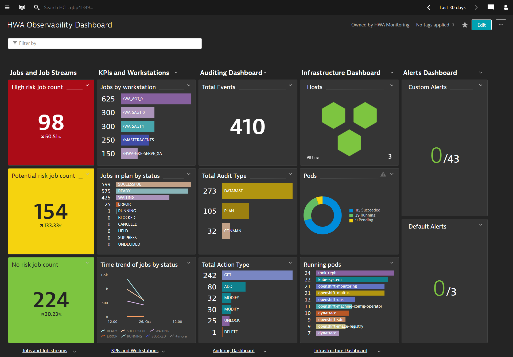

By clicking a button or menu option, you open a new tab displaying the selected dashboard information. The following dashboards are supported: 

- Jobs and Job Streams. This dashboard shows the status of Jobs, Critical Jobs, and Job Streams. 

  Source of Information: HWA Deployment events sidecar container and HWA server Logs.

- KPIs and Workstations. This dashboard shows the HWA KPIs information for each host and allows drilldown to see the timeseries data in a visual representation for the defined KPIs.
 
  Source of Information: API exposed by HWA Server on port 31116.

 - Auditing Dashboard. This dashboard shows details of audit information such as user actions. Users can view audit information for selected time range, user, and object.
 
   Source of Information: HWA Deployment sidecar audit containers, for example: waserver-db-auditing, waserver-plan-auditing etc.
  
- Infrastructure Dashboard. This dashboard provides an overview of the infrastructure details of HWA deployed on Kubernetes cluster.
Filter by your Kubernetes namespace and view the dasboard as shown below.
 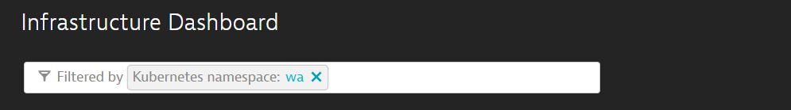
  Source of Information: : OneAgent Monitors the workload automation infrastructures and sent it as metric to Dynatrace.

 - Custom Alerts and Problems. Custom Alerts are created out of HWA Monitoring Application.
 Follow this [Metric events for alerting](https://www.dynatrace.com/support/help/how-to-use-dynatrace/problem-detection-and-analysis/problem-detection/metric-events-for-alerting#create-a-metric-event) documentation to create your problems.
The following table shows some of the out-of-the-box alert definitions that come with the HWA Observability Dashboard​:

| Alert Name	 | Threshold Condition |
| ------ | ------ |
| WA_Broker_Status	 | ==0 (more than 5 minutes in 5 minutes slot ) |
| WA_DB_connected  |	==0 (more than 1 minutes in 3 minutes slot ) |
| WA_FINAL_Error  |	==1 (more than 1 minutes in 3 minutes slot ) |
| WA_FINAL_Late  |	==1 (more than 1 minutes in 3 minutes slot ) |
| WA_LicenseUncounted  |	> 0 (more than 60 minutes in 60 minutes slot) |


## FAQs

1. How many dashboards are available?
     
     You can import and use the following 5 dashboards:
    - HWA Observability Dashboard​ (Overview Dashboard) 
    - Jobs and Job Streams Dashboard
    - KPIs and Workstations Dashboard
    - Auditing Dashboard
    - Infrastructure Dashboard
2. How can I get quick glimpses of various information ?
 
    Use the HWA Observability Dashboard​ for this purpose.
   
3. How can I filter information on dashboards ?

  There is a dynamic filter on each dashboard. Multiple custom dimensions are already present specific to each dashboard. You can use these custom dimensions and give specific input to the filter.
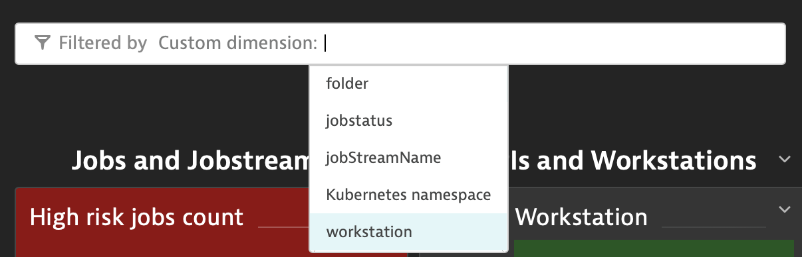
- Steps:
   - Choose Custom dimension over which you want to filter the dashboard. E.g. folder,jobstatus,jobname etc
   - Give any valid dimension value to Custom dimension. The value is case sensitive and should consists of all alphanumeric values and symbols like underscore, hyphen, and so on. For example, if the workstation name is /HWA-GKE-SERVE_XA, value should be same with initial backslash, hyphens at same places and underscore before XA. 
   - Use cases allowed:
         - Filtering based on multiple dimension values for the same custom dimension can be given simultaneously. 
         E.g. folder be filtered with /FOLDER1/ and /FOLDER3/
         - Filtering based on multiple custom dimensions simultaneously. Just keep adding dimensions one by one.
         E.g.workstation:/MASTERAGENTS;folder:/FOLDER4/;jobstatus:READY
         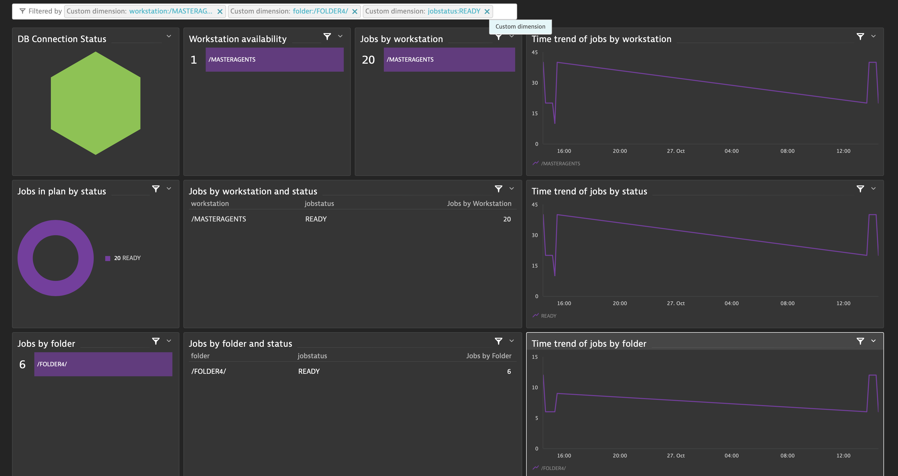
   - If you use incorrect filters, **No data** will appear in certain related blocks in dashboard.
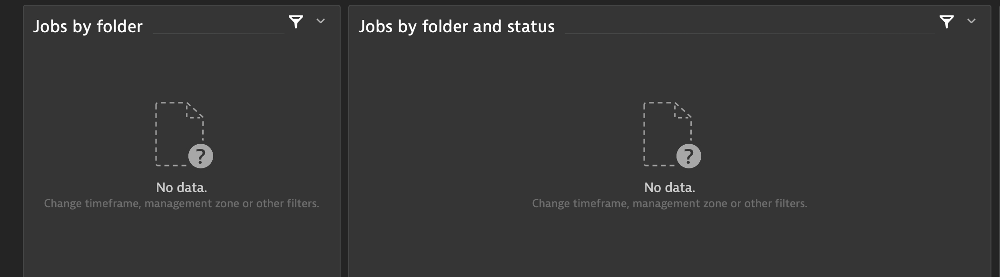
4. How to resolve if am witnessing conflicting information on dashboard?
I am assuming that by conflicting information you mean that for same KPI metric different information is visible on on different blocks of dashboard. Actually, it is expected situation. Let me explain how:
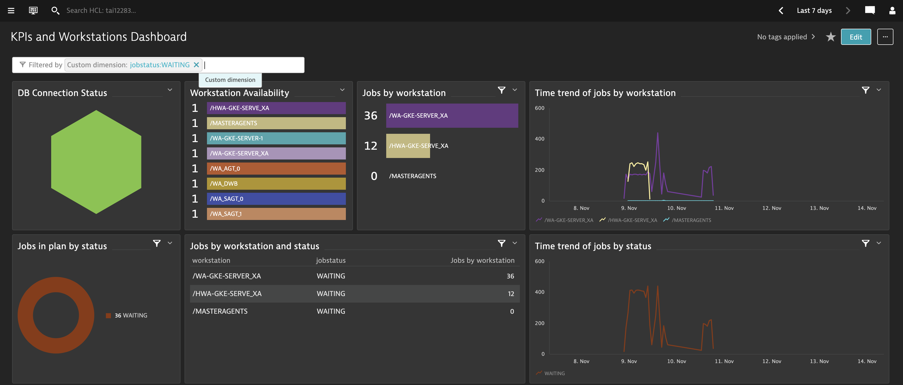
Outcomes which dashboard in above image is indicating :
    - Jobs By Workstation:
        - 36 jobs in /WA-GKE-SERVER_XA workstation
        - 12 jobs in /HWA-GKE-SERVE_XA workstation

    - Jobs in plan by status:
        - 36 jobs are in WAITING
    - Jobs by workstation and status:
        - 36 jobs in WAITING in /WA-GKE-SERVER_XA workstation
        - 12 jobs in WAITING in /HWA-GKE-SERVE_XA workstation

  So,we might feel that Jobs in plan by status is giving incongruent information from Jobs By Workstation and Jobs by workstation and status.Ideally, Jobs in plan by status should have shown 48 jobs in WAITING.
  Actually, **this incongruency is not error**. What must have been is that 12 jobs of WAITING jobstatus might have get closed in the past days(duration set is 7 days)as the analysis which we are getting is aggregated for time duration. Though, Jobs in plan by status doesn't include those closed 12 WAITING jobs but, rest blocks have considered that information too. Similar situation can occur for other KPI metrics too.

5. How to add audit type e.g., Stageman in Auditing Dashboard?

    Replace filter condition with your AuditType e.g. Stageman and follow this procedure for all the new AuditType component:
    - Select Edit option
    - Clone the Dashboard or Plan AuditType component
    - Select Configure tile in Data Explorer
    - Replace the filter condition the following eq("audit.type","STAGEMAN")
    - Select Save changes to dashboard
6. Pods and container names are not matching on configure more logs step for OpenShift?

    Follow the same steps for OpenShift solution and select the workloads, pods contain ***waserver*** name.
 
7. After pods are deleted and recreated the logs path are changed, so the logs are not ingested.
  
    Follow the below Log ingestion steps again:
      - [Configure more logs](#4-configure-more-logs)
      - [Log storage configuration](#5-log-storage-configuration)
8. HWA Observability Dashboard infrastructure details not specific cluster?

    Filter by your Kubernetes namespace and view the infrastructure details .

9. How to get Email if Problem/Alert exist for more than 30 minutes? 
    - In the Dynatrace menu, go to Settings > Alerting > Alerting profiles.
    - Select your Alerting profiles integrated with problem notification.
    - Select Severity rule > Custom Alerts > Add your Problem send delay in minutes.

10. Which version of Dynatrace this setup is supported? 
  
    This setup is supported for Dynatrace SaaS Version 1.252

11. How to uninstall the exporter?
  
     Run the following command **helm uninstall RELEASE_NAME**

12. Job and jobs stream and KPIs and Workstation information are displayed as metrics name?

     Follow the [Setting Metadata](#3-setting-metadata) to update the metrics metadata name.

13. Common mistake on [WA Monitoring Dashboards and Alerts setup in Dynatrace](#wa-monitoring-dashboards-and-alerts-setup-in-dynatrace) step?

    Not copying the Dashboard ID from terminal for further use

14. What are the other ways to get the Dashboard ID? 
  
    Open the Dashboard in the browser and copy the ID field from browser URL.

15. Duplicate Dashboard and Alert are created on the Dynatrace?

    Retrying [Create Dashboards and Alerts](#3-create-dashboards-and-alerts) step mutiple times will create duplicate entry on Dynatrace. So the script is executed wait for some minutes and refresh the Dyntarce and check the Dashboards.

16. How to improvise analysis using dashboard further?
    - In the dashboard, for the pie-chart representation there is a quick way to see specific analysis.
    - Select any of the option which you want to omit e.g., Ready in Job status
    - Select ready and thus, pie-chart will not show results of Ready in pie-chart
  
17. How to Clone dashboard?
     - In the Dynatrace menu, go to Dashboards
     - Filter the respective dashboard and click more symbol
     - Select Clone option.

    
