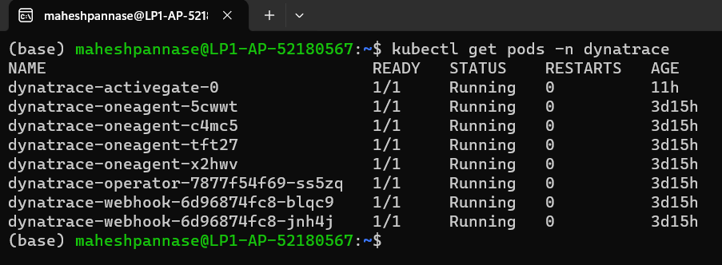
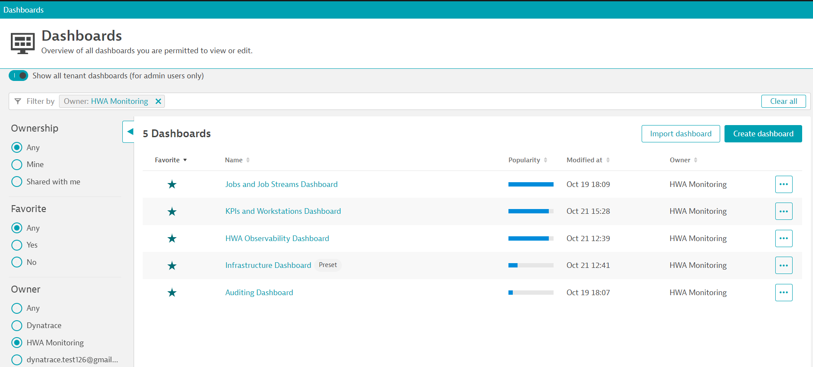
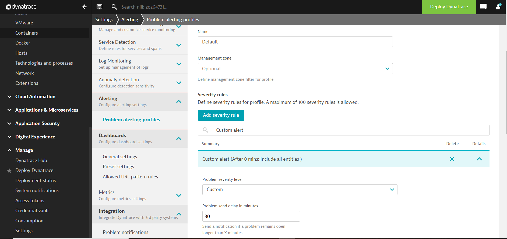

# HCL Workload Automation Observability for Dynatrace

You can use the HCL Workload Automation (HWA) Observability for Dynatrace to monitor HCL Workload Automation metrics, events, audit and infrastructure logs.

## Content
- [HCL Workload Automation Observability for Dynatrace](#hcl-workload-automation-observability-for-dynatrace)
  - [Content](#content)
  - [Prerequisites](#prerequisites)
  - [Language support](#language-support)
  - [Solution setup](#solution-setup)
      - [1. Installating and configuring dynatrace](#1-installating-and-configuring-dynatrace)
      - [2. Install Dynatrace Operator](#2-install-dynatrace-operator)
      - [3. Verify Dynatrace Operator](#3-verify-dynatrace-operator)
      - [4. Verify Dynatrace Monitoring](#4-verify-dynatrace-monitoring)
  - [Log Processing and Ingestion setup](#log-processing-and-ingestion-setup)
      - [1. Log custom attributes](#1-log-custom-attributes)
      - [2. Log processing](#2-log-processing)
      - [3. Log metrics](#3-log-metrics)
      - [4. Configure more logs](#4-Configure-more-logs)
      - [5. Log storage configuration](#5-log-storage-configuration)
  - [Metric Processing and Ingestion setup](#metric-processing-and-ingestion-setup)
      - [1. Metric Ingestion](#1-metric-ingestion)
      - [2. Setting Metadata](#2-setting-metadata)
  - [WA Monitoring Dashboards and Alerts setup in Dynatrace](#wa-monitoring-dashboards-and-alerts-setup-in-dynatrace)
       - [1. Getting Environment Link](#1-getting-environment-link)
       - [2. Create Access Token](#2-create-access-token)
       - [3. Create Dashboards and Alerts](#3-create-dashboards-and-alerts)
       - [4. Configuring dashboard markdown link](#4-configuring-dashboard-markdown-link)
       - [5. Setup Email Notification for Alerts ( Optional )](#5-setup-email-notification-for-alerts--optional-)
         - [a). Configuring Alert Profile](#a-configuring-alert-profile)
         - [b). Configuring Email Integration](#b-configuring-email-integration)
  - [Getting Started with Workload Automation Monitoring](#getting-started-with-workload-automation-monitoring-)
  - [FAQs](#faqs)

## Prerequisites
Following prerequisites must be satisfied prior to deploy the Dynatrace Solution: 
- Kubernetes cluster(GKE) with administrative access
- HWA v10.x installed on the Kubernetes cluster 
- Tools & Packages
  - Dynatrace SaaS Version 1.268

Note: To use the HWA Observability Dashboard for Dynatrace, HWA metrics must be available. For information about HWA exposed metrics, see [Exposing metrics to monitor your workload](https://help.hcltechsw.com/workloadautomation/v102/distr/src_ref/awsrgmonprom.html).


## Language support
For dashboards provided within HWA Observability for Dynatrace, the only supported language is English. 

## Solution setup

NOTE: If you are using Dynatrace version higher than 1.268 switch to the requird version by running the following:

   In the Dynatrace menu > Select user profile > Turn off Latest Dynatrace

### 1. Installating and configuring Dynatrace
1. From [HCL License Portal](https://id.hcltechsw.com/login/login.htm) download the appropriate HWA Observability installation package:
   HWA Observability for Dynatrace Add-on
   
2. Installation package for Dynatrace : HWA_OBSERVABILITY_APP_FOR_DYNATRACE_10.x.tar.gz

3. Follow the below command to untar the gzip file: 
  
  ```
	tar -xvzf HWA_OBSERVABILITY_APP_FOR_DYNATRACE_10.x.tar.gz
  ```

4. Follow the steps mentioned in this ReadMe file to complete the solution setup.

#### 2. Install Dynatrace Operator  

To navigate to Kubernetes page, follow these steps and refer to the picture below:

 
1. Within Dynatrace, click on the Deploy Dynatrace menu
2. Select Start Installation button
3. Select Kubernetes or Openshift based on the HWA installed cluster

To get the Dynatrace Operator installation command, refer to the steps and pictures below:

 
1. On the Kubernetes configuration page, enter dynatrace in the Name field. This is not the cluster name, it will show up as the Kubernetes page name in Dynatrace
2. Select Create token
3. Set the Enable volume storage toggle switch to ON
4. Download dynakube.yaml
5. Click the Copy button

Paste the command in your environment and run it.

#### 3. Verify Dynatrace Operator  

Once the script is complete, monitor the installation until all pods are in Running state with all pods as 1/1.
```
kubectl -n dynatrace get pods
```
Rerun the command until the output looks like this:

 

#### 4. Verify Dynatrace Monitoring
1. Go to Infrastructure Observability > Kubernetes
2. Select Dynatrace cluster name
3. Verify all namespaces are present

 

NOTE : This Dynatrace version is monitoring all the namespaces in the cluster. Add your namespaces in the global filter to see your namespace related information.

## Log Processing and Ingestion setup
 Dynatrace OneAgent collects all logs container and pods then send it to Dynatrace SaaS. The logs are unstructured so, follow the steps to process the logs.  

 NOTE : This Log Processing and Ingestion setup is developed and tested on Dynatrace SaaS Version 1.268.

#### 1. Log custom attributes

1. In the Dynatrace menu, go to Settings.
2. Select Settings > Log Monitoring > Custom attributes and then select Add Custom Attribute.
3. Add key as Attributes table values.
4. Turn on show attribute value in side bar. 
5. Select Save Changes.  

| Attributes |
| ------ | 
| action.type | 
| audit.type |
| framework.user | 
| object.type |
| username | 
| workstationname |


#### 2. Log processing 

1. In the Dynatrace menu, go to Settings
2. Select Settings > Log Monitoring > Processing and then select Add Rule
3. Add Processor name as mentioned below
```
WA Log Parsing
```
4. Add Matcher as mentioned below.
```
content="auditType"
```
5. Add Processor definition as mentioned below:
```
USING(INOUT content)
| PARSE(content,"STRING SPACE 'stdout F' SPACE JSON:content") 
| FIELDS_ADD(object.type: TRIM(STRING(content["objectType"])), 
action.type:TRIM(STRING(content["actionType"])) ,
audit.type:TRIM(STRING(content["auditType"])) ,
workstationname:TRIM(STRING(content["workstationName"])) ,
username:TRIM(STRING(content["userName"])) ,
framework.user:TRIM(STRING(content["frameworkUser"])) )
```
6. Add log sample as mentioned below   
```
{
  "content":"2022-08-26T07:57:09.416740099Z stdout F {\"timestamp\": \"2022-08-26T07:57:09Z\", \"auditType\": \"PLAN    \", \"objectType\": \"PLJOB   \", \"actionType\": \"ADD     \", \"workstationName\": \"HWA-GKE-SERVER-0\", \"userName\": \"wauser\", \"frameworkUser\": \"\", \"objectName\": \"jb=wks=MASTERAGENTS#fol=/JOBS[null].ELA4\", \"actionDependentContents\": \"\"}"
}
```
7. Select Save Changes  

#### 3. Log metrics 

1. In the Dynatrace menu, go to Settings
2. Select Settings > Log Monitoring > Metrics extraction and then select Add log metric 
3. Add Key as mentioned below
```
log.wa.content
```
4. Add Query as mentioned below.
```
content="auditType"
```
5. Select Measure as mentioned below
```
Occurrence of logs records
```
6. Add all the Dimension mentioned below

  | Dimension |
  | ------ | 
  | action.type | 
  | audit.type |
  | framework.user | 
  | object.type |
  | username | 
  | workstationname |

7. Select Save Changes  

#### 4. Configure more logs

1. In the Dynatrace menu, go to Settings.
2. Select Settings > Log Monitoring > Custom log source configuration. 
3. Activate Custom log source if not activated.
4. Add Rule name as WA Log Storage.
5. Select Process groups that contains below text.
```
agent hwa-gke-waserver-*
```
6. Select Log source type as Log path.
7. Add Custom log path source as below.
```
/var/log/pods/*/waserver-plan-auditing/#.log
```
```
/var/log/pods/*/waserver-db-auditing/#.log
```
```
/var/log/pods/*/waserver-bm-events/#.log
```
8. Select Save Changes.


#### 5. Log storage configuration 

1. In the Dynatrace menu, go to Settings
2. Select Settings > Log Monitoring > Log ingest rules and then select Add rule
3. Add Rule name as WA Log Storage
4. Select Rule type as Include in storage
5. Select Add Matcher and then select Matcher attribute as Log Source.
6. Add Value as the below log paths.
```
/var/log/pods/*/waserver-plan-auditing/#.log
```
```
/var/log/pods/*/waserver-db-auditing/#.log
```
```
/var/log/pods/*/waserver-bm-events/#.log
```
7. Then select Add Matcher
8. Select Save Changes  
 

## Metric Processing and Ingestion setup

### 1. Metric Ingestion

1. In Dynatrace, go to Infrastructure Observability > Kubernetes > Select Actions from your Kubernetes cluster > Select settings.
2. Select Monitoring settings page and then enable the below toggles and save the changes
   - Monitor Kubernetes namespaces, services, workloads, and pods
   - Monitor annotated Prometheus exporters

```
kind: Service
apiVersion: v1
metadata:
  name: dynatrace-monitoring-node-exporter
  namespace: wa
  annotations:
    metrics.dynatrace.com/port: '31116'
    metrics.dynatrace.com/scrape: 'true'
    metrics.dynatrace.com/secure: 'true'
    metrics.dynatrace.com/path: '/metrics'
    metrics.dynatrace.com/insecure_skip_verify: 'true'
spec:
  ports:
    - name: dynatrace-monitoring-node-exporter-port
      port: 31116
  selector:
    release: hwa-gke
  clusterIP: None
  ``` 

3. Copy the above service content and save it as dynakube-service.yaml file. 

4. Run the below command and describe any pods from wa and update the dynakube-service.yaml file:
```
kubectl describe pod <POD_NAME>  -n wa
``` 
5. Replace namespace from dynakube-service.yaml with wa namespace.

6. Replace port, path annotation from dynakube-service.yaml with your pod annotation values.

7. Replace release selector from dynakube-service.yaml with wa pod release label value.

8. Run the blow command to create the service:
 ```
 kubectl create -f dynakube-service.yaml
 ```

### 2. Setting Metadata 
There are a few metrics to which you are required to provide metadata to have good analysis on dashboards.

| Metric name	 | Display name |
| ------ | ------ |
| application_wa_criticalJob_highRisk_boolean	 | High risk jobs |
| application_wa_criticalJob_potentialRisk_boolean |	Potential risk jobs |
| application_wa_criticalJob_incompletePredecessor_jobs  | No risk jobs |
| application_wa_DB_connected_boolean  |	DB connection |
| application_wa_JobsByFolder_jobs |	Jobs by folder |
| application_wa_JobsByWorkstation_jobs  |	Jobs by workstation |

Steps to follow:
1. Go to Menu, Observe and Explore > Metrics.
2. In filter bar, enter the name of any metrics mentioned above and that metric will be filtered out.
3. Select Edit metadata.
4. Give Display name which is given in above table respectively.
5. Follow this procedure for all the metrics.


<!--  -->

## WA Monitoring Dashboards and Alerts setup in Dynatrace
   Follow the below steps to upload and configure the WA Monitoring Dashboards and Alerts.
   
NOTE : This Alerts and Email Notification setup is developed and tested on Dynatrace SaaS Version 1.268.

 ##### 1. Getting Environment Link
  1. Get the browser URL of your environment as mentioned below.

 ```
 https://XXXX.YYYY.dynatrace.com
 ```


 ##### 2. Create Access Token
 1. In the Dynatrace menu, go to Access Token and then select Generate new Token
 2. Add your Token name , Expiration date 
 3. Select template as None
 4. Select the scopes mentioned below table.

 | Scope |
| ------ | 
| Write configuration | 
| Ingest metrics |

 5. Select Generate Token and then Copy the Generated Token for further use.

 ##### 3. Create Dashboards and Alerts


1. Run the starter.sh with your ***ENVIRONMENT_LINK***, ***ACCESS_TOKEN*** as parameters. Follow this below command as example.

```
 $ sh ./starter.sh ENVIRONMENT_LINK ACCESS_TOKEN 
```

 
 
 2. Copy the Dashboard ID from terminal for further use

 3. In the Dynatrace menu, go to Dashboards  
  
    - Turn ON show all tenant dasboards option
    - Select Owner as HWA Monitoring
    - Verify all the dashboards are created

 

 4. In the Dynatrace menu, go to Settings
       - Go to Setting > Anomaly detection > Metric events for alerting
       - Verify all the created alerts


 ##### 4. Configuring dashboard markdown link

 The HWA Observability Dashboard​ provides the link to all dashboards. Once the dashboard is created, new dashboard id is generated for each and every dashboards. So every dashboard id needs to be updated on the HWA Observability Dashboard​ markdown component.

1. Get the copied dashboard id from the Create dashboard step
2. In the Dynatrace menu, go to Dashboards  
3. Select HWA Observability Dashboard​
    - Select Edit option at the top right corner
    - Go to the bottom of the dashboard
    - Select the markdown component as shown in the image and replace your ENVIRONMENT_LINK and id with your respective dashboard id
    - Do this same step for all dashboards. ( Jobs and Job Streams,KPIS and Workstation,Auditing Dashboard,Infrastructure Dashboard ) 

 

4. Select Done

 ##### 5. Setup Email Notification for Alerts ( Optional )
 

 ###### a). Configuring Alert Profile

 1. In the Dynatrace menu, go to Settings > Problem alerting profiles  > Add alerting profiles
 2. Type a name for the new profile in the Create new alerting profile field and select Create
 3. Select Add severity rule then select Problem severity level as **Custom**
 4. Add Problem send delay in minutes as per your requirement. For example, if you add 30, then an email notification will be sent only if the problem remains open for 30 minutes.
 5. Select Save Changes. Keep a note of your Alert Profile Name for future use.   


 


 ###### b). Configuring Email Integration

   Follow this [Email Integration](https://docs.dynatrace.com/docs/observe-and-explore/notifications-and-alerting/problem-notifications/email-integration) documentation to configure email notification for alerts.

 

  NOTE : Select the Alerting Profile Name you have configured in the previous step.


## Getting Started with Workload Automation Monitoring

The HWA Observability Dashboard​ provides a single, consolidated view for monitoring the workload status. By selecting the dashboard on the list, you can see the information related to that dashboard.

- **HWA Observability Dashboard**​:

 

By clicking a button or menu option, you open a new tab displaying the selected dashboard information. The following dashboards are supported: 

- **Jobs and Job Streams**. This dashboard shows the status of Jobs, Critical Jobs, and Job Streams. 

  Source of Information: HWA Deployment events sidecar container and HWA server Logs.

- **KPIs and Workstations**. This dashboard shows the HWA KPIs information for each host and allows drilldown to see the timeseries data in a visual representation for the defined KPIs.
 
  Source of Information: API exposed by HWA Server on port 31116.

 - **Auditing Dashboard**. This dashboard shows details of audit information such as user actions. Users can view audit information for selected time range, user, and object.
 
   Source of Information: HWA Deployment sidecar audit containers, for example: waserver-db-auditing, waserver-plan-auditing etc.
  
- **Infrastructure Dashboard**. This dashboard provides an overview of the infrastructure details of HWA deployed on Kubernetes cluster.
Filter by your Kubernetes namespace and view the dasboard as shown below.
 
  Source of Information: : OneAgent Monitors the workload automation infrastructures and sent it as metric to Dynatrace.

 - **Custom Alerts and Problems**.
  Custom Alerts are created out of HWA Monitoring Application.
 Follow this [Metric events for alerting](https://www.dynatrace.com/news/blog/custom-alerts-set-get/#:~:text=To%20define%20a%20custom%20alert%201%20Go%20to,and%20the%20unique%20conditions%20of%20your%20environment.%20) documentation to create your problems.
The following table shows some of the out-of-the-box alert definitions that come with the HWA Observability Dashboard​:

| Alert Name	 | Threshold Condition |
| ------ | ------ |
| WA_Broker_Status	 | ==0 (more than 5 minutes in 5 minutes slot ) |
| WA_DB_connected  |	==0 (more than 1 minutes in 3 minutes slot ) |
| WA_FINAL_Error  |	==1 (more than 1 minutes in 3 minutes slot ) |
| WA_FINAL_Late  |	==1 (more than 1 minutes in 3 minutes slot ) |
| WA_LicenseUncounted  |	> 0 (more than 60 minutes in 60 minutes slot) |


## FAQs


1. Q: The ReadMe steps mentioned in the Log storage configuration section were not present in Dynatrace

   A: Update to new Log storage configuration if not updated.

2. Q. The ReadMe steps mentioned in the  Custom log source configuration wwere not present in Dynatrace
 
   A: Activate Custom log source if not activated.

3. Q: On which version of Dynatrace is this Solution Developed/Tested?
  
   A: This solution is Developed/Tested on Dynatrace SaaS Version 1.268

4. Q: How can I switch to Dynatrace version 1.268 from higer version? 
  
   A: In the Dynatrace menu > Select user profile > Turn off Latest Dynatrace.

5. Q: Metrics are not ingested into Dynatrace  
     
   A: In Dynatrace, go to your Kubernetes cluster settings page and enable
     - Monitor Kubernetes namespaces, services, workloads, and pods
     - Monitor annotated Prometheus exporters

6. Q: How can I get quick glimpses of various information ?
 
   A: Use the HWA Observability Dashboard​ for this purpose.
   
7. Q: How can I filter information on dashboards?

   A: There is a dynamic filter on each dashboard. Multiple custom dimensions are already present specific to each dashboard. You can use these custom dimensions and give specific input to the filter.
   

8. Q: How many dashboards are available?
     
   A: You can import and use the following 5 dashboards:
    - HWA Observability Dashboard​ (Overview Dashboard) 
    - Jobs and Job Streams Dashboard
    - KPIs and Workstations Dashboard
    - Auditing Dashboard
    - Infrastructure Dashboard

9. Q: How can I see infrastructure details for a specific cluster?

   A: Filter by your Kubernetes namespace and view the infrastructure details.

10. Q: How to get Email if Problem/Alert exists for more than 30 minutes?
    
    A: In the Dynatrace menu, go to Settings > Alerting > Alerting profiles.
    - Select your Alerting profiles integrated with problem notification.
    - Select Severity rule > Custom Alerts > Add your Problem send delay in minutes.

11. Q: Are Jobs, Job streams, KPIs and Workstation information displayed as metrics name?

    A: Follow the [2. Setting Metadata](#2-setting-metadata) to update the metrics metadata name.


12. Q: What are the other ways to get the Dashboard ID? 
  
    A: Open the Dashboard in the browser and copy the ID field from browser URL.

13. Q: Duplicate Dashboard and Alert are created on Dynatrace?

    A: Retrying [Create Dashboards and Alerts](#3-create-dashboards-and-alerts) step mutiple times will create duplicate entry on Dynatrace. After the script is executed, wait for some minutes to refresh Dynatrace and check the Dashboards.

14. Q: How to further improve analysis using dashboard?
    A: In the dashboard, for the pie-chart representation there is a quick way to see specific analysis.
    - Select any of the option you want to omit e.g., Ready in Job status
    - Select ready and thus the pie-chart will not show the Ready results
  
15. Q: How to Clone dashboard?

    A: Run the following steps:
    - In the Dynatrace menu, go to Dashboards
    - Filter the respective dashboard and click the More icon 
    - Select the Clone option.

16. Q: Logs are not ingested into Dynatrace after redploying HWA installation? 
   
    A: New Process group will be generated for new deployment. So redo the step 
    [5. Log storage configuration](#5-log-storage-configuration) again.
    
